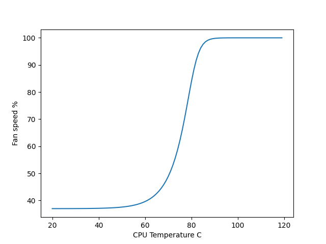

# ipmi fan control

ipmi kinda sucks. This motherboard doesn't work with lm-sensors or pwmconfig. This script checks my CPU and Nvidia GPU temps once a second and adjusts all the fans.

## Requirements:
- python
- ipmitools
    ```
    sudo apt install ipmitools
    ```
- (optional) cuda toolkit if you want to monitor GPU temps


## Run without installing
Beware! If you run without installing, the script will not restart if it dies and will not start on boot.
```
sudo python3 fanspeed.py --config config.yaml
```

## Install:
1. Configure your desired temperature ranges by modifying [config.yaml](config.yaml). You can do this later by making changes here and re-running the install script.
3. Run the install script. It creates a systemd service that runs the [fanspeed.py](fanspeed.py) script:
    ```
    sudo ./install.sh
    ```

## Uninstall
    ```
    sudo ./uninstall.sh
    ```

## Default Fan Curve:
For all temperatures between the ranges defined in [config.yaml](config.yaml), fan speed is interpolated along a curve.

Feel free to use whatever curve suits your needs best, but this is the one I decided on. It's a mutation of the sigmoid function that ramps up slowly and takes off as temperatures get close to the configured upper bound.

