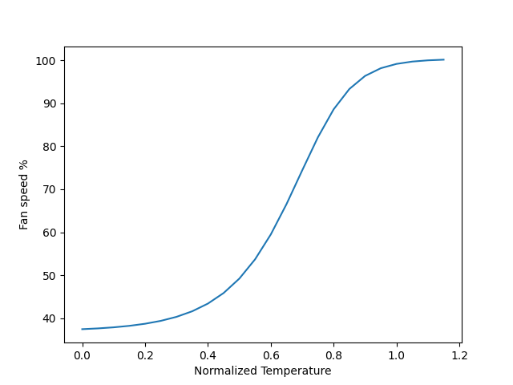

# ipmi fan control

ipmi kinda sucks. This motherboard doesn't work with lm-sensors or pwmconfig. This script checks my CPU and Nvidia GPU temps once a second and adjusts all the fans.

## Requirements:
A working cudatoolkit install, ipmitools
```
sudo apt install ipmitools
```

## Installation:
You're gonna want to modify `customfancontrol.service` to reflect the path of this repo.
The install script creates a systemd service that runs the `fanspeed.py` script:
```
sudo ./install.sh
```

## Default Fan Curve:
Feel free to use whatever curve suits your needs best, but this is the one I decided on. It's a mutation of the sigmoid function that ramps up slowly and takes off as temperatures get close to the configured upper bound.

